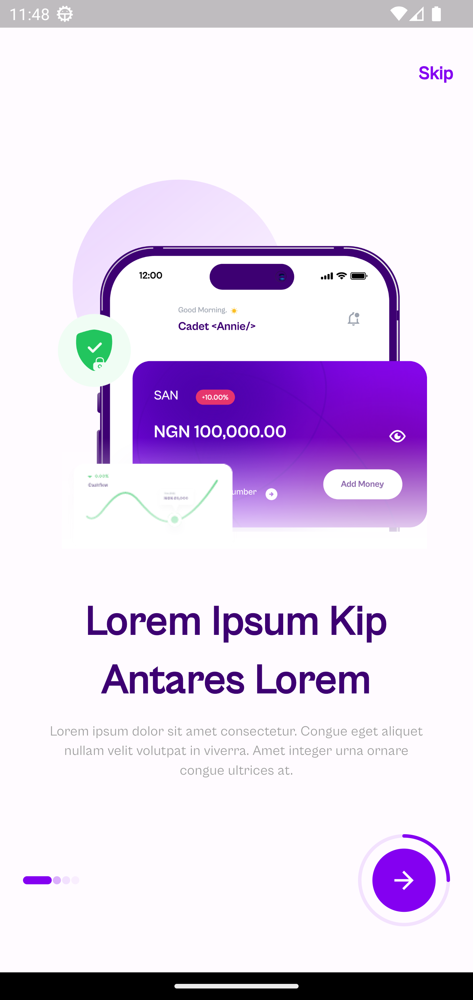
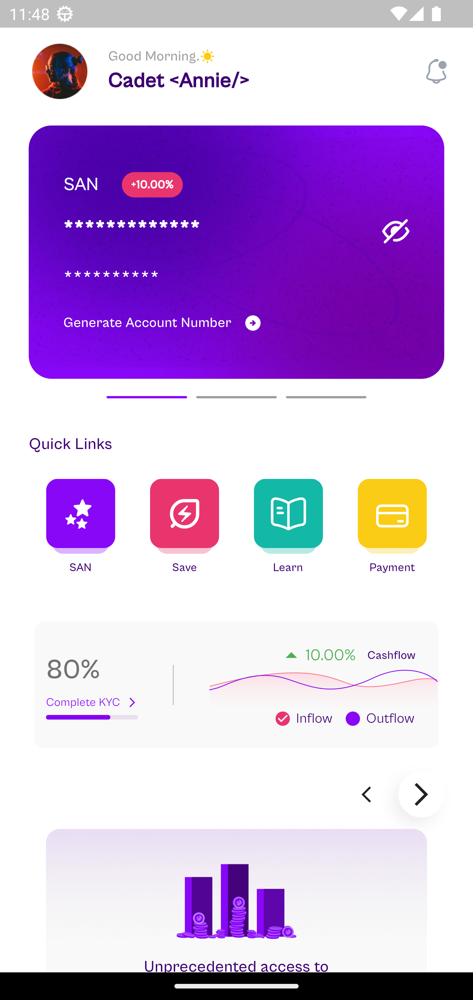

# ardilla_assessment

## Screenshots

| Screen 1                                    | Screen 2                                    |
|---------------------------------------------|---------------------------------------------|
|  |  |

## Getting Started

These instructions will help you get a copy of the project up and running on your local machine.

### Prerequisites

- Flutter SDK: [Installation Guide](https://flutter.dev/docs/get-started/install)

### Installing

1. Clone the repository: `git clone https://github.com/your-username/your-repository.git`
2. Change to the project directory:
3. Fetch the dependencies:
4. Run the app:

### Link to release
[app-arm64-v8a-release.apk](https://github.com/emmalexander/ardilla_assessment/releases/download/v1.0.0/app-arm64-v8a-release.apk)
[app-armeabi-v7a-release.apk](https://github.com/emmalexander/ardilla_assessment/releases/download/v1.0.0/app-armeabi-v7a-release.apk)
[app-x86_64-release.apk](https://github.com/emmalexander/ardilla_assessment/releases/download/v1.0.0/app-x86_64-release.apk)

### Contact
- [email](mailto:emmanuelohiocheoya@gmail.com)
- [Project Link](https://github.com/emmalexander/ardilla_assessment)
